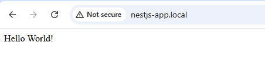
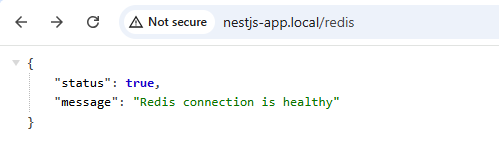
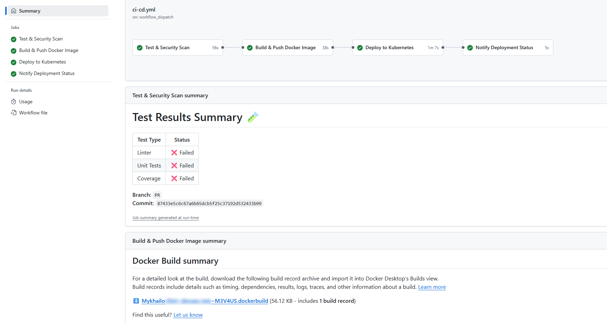
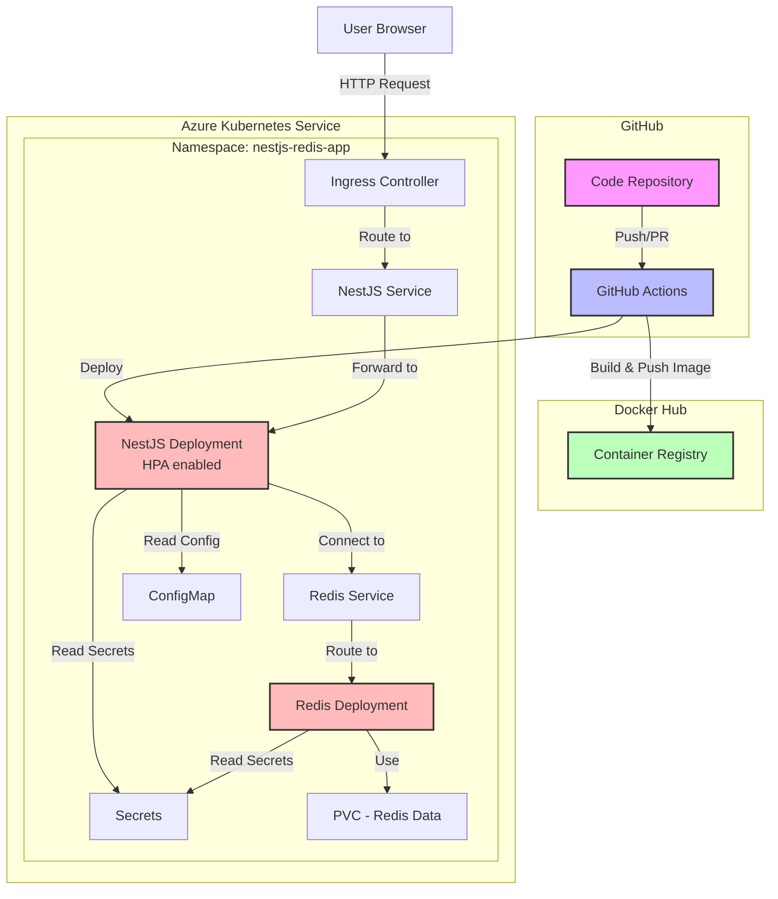
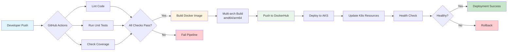
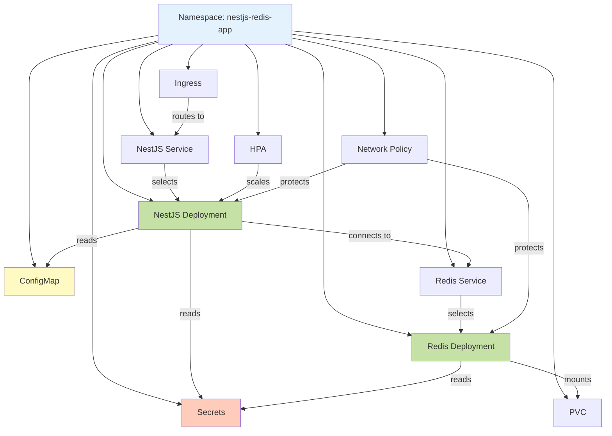
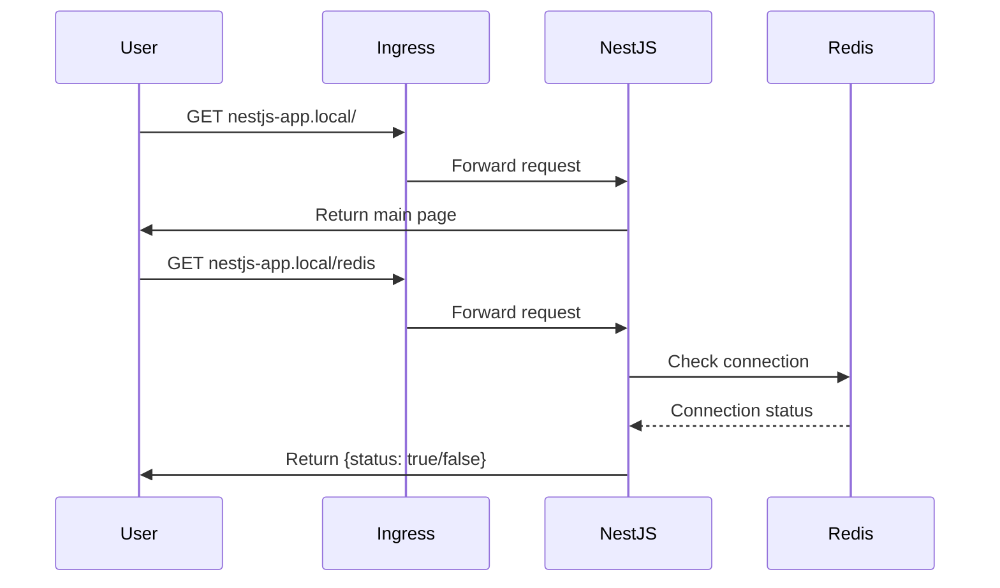

# Deploy infra on Azure
- create RG
- create AKS cluster
- enable "application routing"  https://learn.microsoft.com/en-us/azure/aks/app-routing
   `az aks approuting enable --resource-group <ResourceGroupName> --name <ClusterName>`
- get kubeconfig
  `az account set --subscription <ID>`
  `az aks get-credentials --resource-group <ResourceGroupName> --name <ClusterName> --overwrite-existing`


# CI/CD
## Add secrets to Github
add repository secrets:
- DOCKERHUB_TOKEN: dockerhub token
- DOCKERHUB_USERNAME: dockerhub username
- K8S_CLUSTER: cluster name `<ClusterName>`
- KUBECONFIG: kubeconfig from `az aks get-credentials `
- REDIS_PASSWORD: password for Redis. Do not use quotes in password

# Edit "hosts" file
- Obtain application IP
  Get AKS IP
  `kubectl get service -n nestjs-redis-app nestjs-ingress -o jsonpath="{.status.loadBalancer.ingress[0].ip}"`
- edit `/etc/hosts` (for Linux) or `C:\windows\system32\drivers\etc\hosts` (for MacOS) and add line with site IP from previous step
e.g.
`10.11.12.13 nestjs-app.local`

Open site in browser
- [http://nestjs-app.local](http://nestjs-app.local) \
 \

- [http://nestjs-app.local/redis](http://nestjs-app.local/redis) - for Redis check \



# Extra notes
- CI/CD can buld images for `amd64`, `arm64` arch. Pls uncomment proper line in [ci-cd.yml](/.github/workflows/ci-cd.yml)
- In Github Action on Summary page can see test results `Test Results Summary`
this app fails all tests
```markdown
# Test Results Summary 🧪

| Test Type  | Status   |
| ---------- | -------- |
| Linter     | ❌ Failed |
| Unit Tests | ❌ Failed |
| Coverage   | ❌ Failed |

**Branch:** `test`
**Commit:** `87433e5c6c67a6b65dcb5f25c37192d532433b99`
```


- added HPA Horizontal pod autoscaller
- k8s: Networks policy and monitoring manifests (commented now)
```yaml
        # deployment/k8s/monitoring.yaml
        # deployment/k8s/network-policy.yaml
```
in [pipelene](/.github/workflows/ci-cd.yml)


# Виконані вимоги


### 1. Dockerfile

- [✅] Створити оптимізований багатоетапний Dockerfile
- [✅] Використовувати офіційні базові образи
- [✅] Мінімізувати розмір кінцевого образу
- [✅] Налаштувати користувача без root прав
- [✅] Правильно обробити залежності Node.js
- [✅] Використовувати .dockerignore

### 2. CI/CD Pipeline

Налаштувати pipeline для GitHub Actions або GitLab CI з етапами:

- [✅] Збірка Docker образу
- [✅] Push образу в registry
- [✅] Деплой у Kubernetes
- [✅] Використання змінних середовища та secrets

### 3. Kubernetes Маніфести

- [✅] Deployment, Service, Ingress для NestJS додатку
- [✅] Deployment, Service для Redis
- [✅] ConfigMap, Secrets для конфігурації
- [✅] Правильні labels та selectors
- [✅] Resource limits та requests

### 4. Інтеграція з Redis

- [✅] Redis розгорнуто у кластері
- [✅] Додаток успішно підключається до Redis
- [✅] Ендпоінт `/redis` працює коректно

### 5. Secrets та Безпека

- [✅] Використання Kubernetes Secrets для чутливих даних
- [✅] Пароль Redis зберігається в Secret
- [✅] NetworkPolicy для обмеження трафіку (бонус)
- [✅] SecurityContext у pod'ах
- [✅] Не використовуються root права в контейнерах

### 6. Додаткові Вимоги

- [✅] Детальний README з інструкціями по налаштуванню
- [✅] Health checks та Autoscaler
- [✅] Коментарі в коді та маніфестах
- [ ] Моніторинг з Prometheus/Grafana  - `не вистачило часу`


# Architecture

## System Architecture Diagram



## CI/CD Pipeline Flow



## Kubernetes Resource Dependencies



## Application Flow


